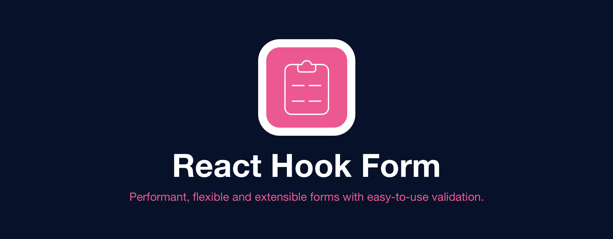

# Building Type-Safe Forms in React

## Brendan Allan

---

TODO: About me

---
layout: center
---

<!-- We're building an open-source file browser with a React-powered UI and Rust backend that generates and synchronises an index of all your files across all your devices -->

<div class="flex flex-col space-y-6 items-center">
	
	
</div>

---
class: text-center
layout: default
---

<div class="w-full h-full flex flex-col items-center justify-center transform scale-75">
	<Tweet class="min-w-lg" id="1610812416207495174" />
	<Tweet class="min-w-lg" id="1255179383372836869" />
</div>

---

# Spacedrive Forms

- Location settings
- Onboarding form

---
layout: center
---

<div class="flex flex-row space-x-8 items-center">

```tsx {all|2-3|10-19|20|6-9|all}
function LoginForm() {
	const [email, setEmail] = useState("");
	const [password, setPassword] = useState("");

	return (
		<form onSubmit={(e) => {
			e.preventDefault();
			console.log({ email, password })
		}}>
			<input
				name="email" type="email" required
				value={email}
				onChange={e => setEmail(e.target.value)}
			/>
			<input
				name="password" type="password" required
				value={password}
				onChange={e => setPassword(e.target.value)}
			/>
			<button type="submit" />
		</form>
	)
}
```

</div>
---
layout: center
---

- TODO: NextJS

```tsx
function LoginForm() {
	const [email, setEmail] = useState("");
	const [password, setPassword] = useState("");

	return (
		<form onSubmit={(e) => {
			e.preventDefault();
			console.log({ email, password })
		}}>
			<input
				name="email" type="email" required
				value={email}
				onChange={e => setEmail(e.target.value)}
			/>
			<input
				name="password" type="password" required
				value={password}
				onChange={e => setPassword(e.target.value)}
			/>
			<button type="submit" />
		</form>
	)
}
```

- TODO: Remix

---
layout: center
---

<div class="flex flex-row space-x-4 items-center">

```tsx
function LoginForm() {
	const [email, setEmail] = useState("");
	const [password, setPassword] = useState("");

	return (
		<form onSubmit={(e) => {
			e.preventDefault();
			console.log({ email, password })
		}}>
			<input
				name="email" type="email" required
				value={email}
				onChange={e => setEmail(e.target.value)}
			/>
			<input
				name="password" type="password" required
				value={password}
				onChange={e => setPassword(e.target.value)}
			/>
			<button type="submit" />
		</form>
	)
}
```

<span>
<v-clicks depth="2">

- Works fine for small forms 🤷
- Not typesafe 😡
	- We'll get there...

</v-clicks>
</span>

</div>

---
layout: center
class: text-center
---





---
layout: center
---

<div class="flex flex-row items-center space-x-8">

<div>

```tsx {2-3|7-8|12-13,17-18|all} {at:0}
function LoginForm() {
	const [email, setEmail] = useState("");
	const [password, setPassword] = useState("");

	return (
		<form onSubmit={(e) => {
			e.preventDefault();
			console.log({ email, password })
		}}>
			<input
				type="email" required
				name="email" value={email}
				onChange={e => setEmail(e.target.value)}
			/>
			<input
				type="password" required
				name="password" value={password}
				onChange={e => setPassword(e.target.value)}
			/>
			<button type="submit" />
		</form>
	)
}
```

</div>

<div>

```tsx {4|8|12,16|all} {at:0}
import { useForm } from "react-hook-form";

function LoginForm() {
	const form = useForm();

	return (
		<form onSubmit={
			form.handleSubmit((data) => console.log(data))
		}>
			<input
				type="email" required
				{...register("email")}
			/>
			<input
				type="password" required
				{...register("password")}
			/>
			<button type="submit" />
		</form>
	)
}
```

</div>

</div>
